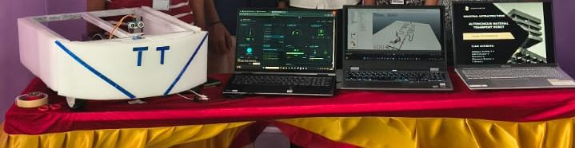

<div align="center">


<br/>

[](https://www.pragyan.org)
[](https://github.com)

<br/>


<br/>


</div>

---

## 📌 Table of Contents

- [Overview](#-overview)
- [Demo](#-demo)
- [Key Innovation — Poor Man's LIDAR](#-key-innovation--poor-mans-lidar)
- [System Architecture](#-system-architecture)
- [Features](#-features)
- [Hardware Stack](#-hardware-stack)
- [Repository Structure](#-repository-structure)
- [Getting Started](#-getting-started)
- [Web Dashboard](#-web-dashboard)
- [Test Results](#-test-results--validation)
- [Recognition](#-recognition)
- [License](#-license)

---

## 🤖 Overview

> **Autonomous Material Transport Rover** is a low-cost, embedded-systems-based AGV (Automated Guided Vehicle) designed to replace expensive industrial robots in small and medium-scale manufacturing environments.

Built for **narrow-aisle, human-shared workspaces**, the rover combines IR line navigation, RFID-based station docking, real-time payload monitoring, and a novel **servo-mounted ultrasonic obstacle scanner** — delivering industrial-grade automation at a fraction of conventional AGV costs.

```
Target Environment : Small-to-medium factories, warehouses, labs
Payload Capacity   : 20 – 25 kg
Navigation Method  : IR Line Following + RFID Junction Recognition
Obstacle Detection : Poor Man's LIDAR (Servo + HC-SR04)
Control Unit       : ESP32-S3 (WiFi + Bluetooth 5.0)
Monitoring         : Real-Time Web Dashboard (WebSocket)
```

---

## 🎬 Demo

### Prototype

<div align="center">
  
</div>

### Live Demo

<div align="center">
  <a href="media/demo.mp4">
    
  </a>
  <br/>
  <em>▶ Click to watch demo — Full autonomous navigation cycle with obstacle avoidance</em>
</div>

> 📺 Also on YouTube: [Watch Demo](https://youtube.com/YOUR_LINK)

---

## 💡 Key Innovation — Poor Man's LIDAR

Traditional industrial LIDAR sensors cost **$100–$500+**. We engineered an equivalent at **< ₹500**.

| Parameter | Industrial LIDAR | Poor Man's LIDAR |
|-----------|-----------------|-----------------|
| Cost | $100 – $500 | < ₹500 (~$6) |
| Angular Range | 360° | 30° – 150° |
| Sensor | Laser Time-of-Flight | HC-SR04 Ultrasonic |
| Actuator | Spinning motor | MG90S Servo |
| Output | Full point cloud | Obstacle map + safe direction |

**Working Principle:**
1. Servo rotates the ultrasonic sensor from **30° → 150°** in discrete steps
2. Distance is measured at each angular position
3. Angle-distance pairs form a **basic obstacle map**
4. Controller selects the **safest navigation direction** autonomously

---

## 🏗 System Architecture

```
┌─────────────────────────────────────────────────────────┐
│                     ESP32-S3 CORE                        │
│                                                          │
│  ┌──────────────┐   ┌───────────────┐   ┌────────────┐  │
│  │  Navigation  │   │    Safety     │   │  Comms     │  │
│  │  ──────────  │   │  ──────────── │   │  ───────── │  │
│  │  IR Array    │   │  Bump Sensor  │   │  WiFi AP   │  │
│  │  RFID RC522  │   │  IMU MPU6050  │   │  WebSocket │  │
│  │  PID Control │   │  Load Cell    │   │  Dashboard │  │
│  └──────────────┘   └───────────────┘   └────────────┘  │
│                                                          │
│  ┌─────────────────────────────────────────────────┐    │
│  │          Poor Man's LIDAR Module                 │    │
│  │   Servo MG90S ──► HC-SR04 ──► Obstacle Map      │    │
│  └─────────────────────────────────────────────────┘    │
└─────────────────────────────────────────────────────────┘
           │                         │
    ┌──────▼──────┐          ┌───────▼──────┐
    │  BTS7960    │          │  Web Browser │
    │  Dual Motor │          │  Dashboard   │
    │  Driver     │          │  (Telemetry) │
    └─────────────┘          └─────────────┘
```

---

## ✨ Features

### 🧭 Navigation
- **IR Sensor Array** — 5-channel line detection for precise path tracking
- **PID Line Following** — smooth, oscillation-free tracking at operating speed
- **RFID Station Recognition** — junction-level command execution (stop / turn / dock)
- **Bump Sensing** — collision detection as a last-resort safety layer

### 🔍 Obstacle Avoidance
- **Poor Man's LIDAR** — servo-swept ultrasonic scanning at 30°–150°
- **Threshold-Based Halt** — immediate stop on object detection within safe zone
- **Path Re-evaluation** — selects freest direction from obstacle map

### ⚖️ Payload Management
- **HX711 + Load Cell** — real-time weight measurement
- **Pickup / Drop Detection** — state machine triggers on weight delta
- **Overload Alert** — WebSocket push notification to dashboard

### 🛡️ Safety Systems
- **MPU6050 IMU** — tilt angle monitoring, cutoff on excessive lean
- **Bump Sensors** — front physical collision detection
- **Dashboard Alerts** — obstacle / tilt / overload warnings in real time

### 📊 Web Dashboard
- Live IR sensor path status
- Ultrasonic distance graph
- RFID station ID feed
- Payload weight readout
- IMU tilt visualization
- Alert notification panel

---

## 🔧 Hardware Stack

| Component | Model | Purpose |
|-----------|-------|---------|
| Microcontroller | ESP32-S3 | Main controller + WiFi |
| Motor Driver | BTS7960 (×2) | High-current DC motor control |
| IR Sensor Array | 5-channel | Line detection |
| RFID Reader | RC522 | Junction/station recognition |
| Ultrasonic Sensor | HC-SR04 | Obstacle detection |
| Servo Motor | MG90S | Poor Man's LIDAR sweep |
| IMU | MPU6050 | Tilt & stability monitoring |
| Load Cell + ADC | 50kg + HX711 | Payload measurement |
| Bump Sensor | Mechanical | Physical collision detection |
| Chassis | Custom | Reinforced for 20–25 kg load |
| Motors | DC Geared | High-torque traction |

> 📄 Full BOM with part numbers and cost: [`hardware/bom.csv`](hardware/bom.csv)

---

## 📁 Repository Structure

```
autonomous-transport-rover/
├── firmware/
│   ├── src/
│   │   ├── main.cpp
│   │   ├── navigation/          # IR, RFID, PID
│   │   ├── sensors/             # Ultrasonic, IMU, Load Cell
│   │   └── comms/               # WiFi, WebSocket
│   ├── include/
│   ├── lib/
│   └── platformio.ini
├── dashboard/
│   ├── index.html               # Real-time telemetry UI
│   └── ws_handler.js
├── hardware/
│   ├── schematics/              # Circuit diagrams (PDF + KiCad)
│   └── bom.csv
├── docs/
│   ├── architecture.md
│   ├── wiring_guide.md
│   └── test_cases.md
├── media/
│   ├── demo.mp4                 # ← DROP YOUR VIDEO HERE
│   └── images/
│       ├── prototype.jpg        # ← DROP YOUR PHOTO HERE
│       └── demo_thumbnail.jpg   # ← THUMBNAIL FOR VIDEO PREVIEW
├── .github/
│   └── workflows/
│       └── build.yml
├── README.md
├── LICENSE
├── CHANGELOG.md
└── CONTRIBUTING.md
```

---

## 🚀 Getting Started

### Prerequisites

```bash
# Install PlatformIO CLI
pip install platformio

# Clone the repository
git clone https://github.com/Ashwinkumar-k10/autonomous-transport-rover.git
cd autonomous-transport-rover/firmware
```

### Flash Firmware

```bash
# Build
pio run

# Upload to ESP32-S3
pio run --target upload --upload-port /dev/ttyUSB0

# Monitor serial output
pio device monitor --baud 115200
```

### Configure WiFi

Edit `firmware/src/comms/wifi_config.h`:
```cpp
#define WIFI_SSID     "your_ssid"
#define WIFI_PASSWORD "your_password"
#define WS_PORT       81
```

### Open Dashboard

After flashing, the ESP32-S3 prints its IP to Serial. Open:
```
http://<ESP32_IP>/dashboard
```

---

## 📡 Web Dashboard

The dashboard streams live telemetry via **WebSocket** at 10 Hz.

| Panel | Data |
|-------|------|
| Path Status | IR sensor array (5-channel binary) |
| Obstacle Distance | Ultrasonic reading (cm) + LIDAR sweep map |
| RFID Log | Station ID + last command |
| Payload | Live weight (kg) + state |
| IMU | Roll / Pitch tilt angles |
| Alerts | Obstacle / Overload / Tilt / Path-loss |

---

## ✅ Test Results & Validation

All modules passed integration testing. Full log: [`docs/test_cases.md`](docs/test_cases.md)

| Module | Test ID | Result | Description |
|--------|---------|--------|-------------|
| ESP32-S3 Boot | SYS_TC_01 | ✅ Pass | All sensors & drivers initialized |
| Motor Driver (×2) | MOT_TC_01/02 | ✅ Pass | Forward motion, smooth drive |
| IR Sensor Array | IR_TC_01 | ✅ Pass | Line detected accurately |
| Ultrasonic | ULT_TC_01 | ✅ Pass | Obstacle at threshold distance |
| Poor Man's LIDAR | ULT_TC_02 | ✅ Pass | Free path identified via sweep |
| Servo Sweep | SERVO_TC_01 | ✅ Pass | 30°–150° rotation achieved |
| RFID Detection | RFID_TC_01 | ✅ Pass | UID read successfully |
| RFID Navigation | RFID_TC_02 | ✅ Pass | Correct station action performed |
| Load Cell | LOAD_TC_01 | ✅ Pass | Weight displayed accurately |
| IMU Tilt | IMU_TC_01 | ✅ Pass | Tilt angle detected correctly |
| Dashboard | DASH_TC_01 | ✅ Pass | Live telemetry streamed |
| Full Integration | INT_TC_01 | ✅ Pass | End-to-end transport cycle |

**12 / 12 test cases passed.**

---

## 🏆 Recognition

| Event | Organizer | Category | Result |
|-------|-----------|----------|--------|
| **Ingenium '26** | Pragyan, NIT Trichy | Industrial Automation | 🥈 **Runner-Up** |

---

## 📄 License

This project is licensed under the **MIT License** — see [`LICENSE`](LICENSE) for details.

---

<div align="center">


*Open-source robotics — Star ⭐ the repo if it helped you build something awesome*

</div>
